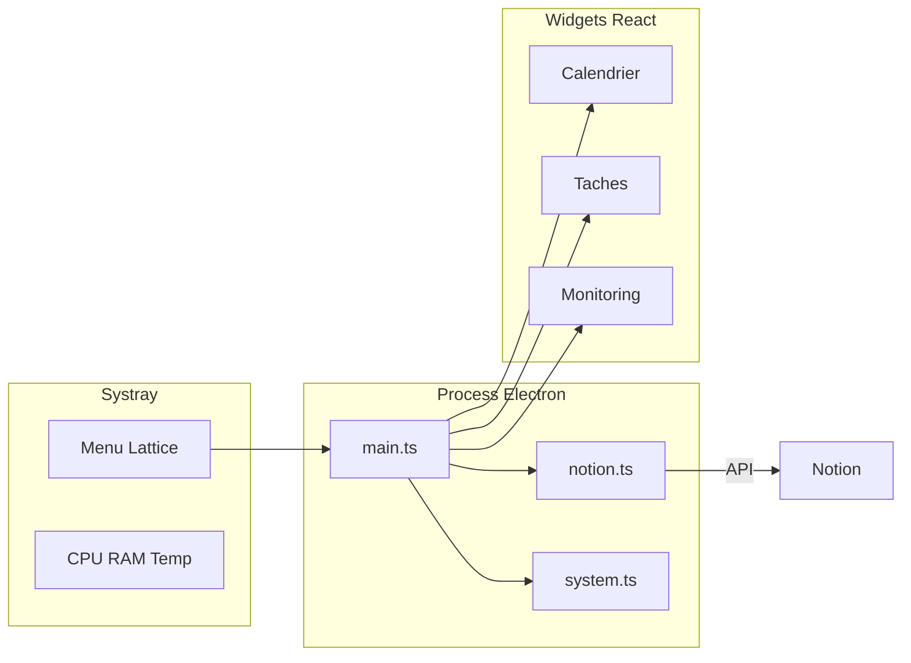

[English](README.md) · [Français](README.fr.md)

# Lattice

<p align="center">
  
</p>

<p align="center">
  <a href="https://skillicons.dev">
    
  </a>
</p>

<p align="center">
  
  
  
  
</p>

> Widgets bureau composables pour Windows — plateforme shell : activez uniquement les widgets dont vous avez besoin (Notion, monitoring, …).

## Table des matières

- [Pourquoi Lattice](#pourquoi-lattice)
- [Fonctionnalités](#fonctionnalités)
- [Démarrage rapide](#démarrage-rapide)
- [Pour les développeurs](#pour-les-développeurs)
- [Commandes](#commandes)
- [Documentation](#documentation)
- [Auteur](#auteur)
- [Licence](#licence)

## Pourquoi Lattice

- **Plateforme d’abord** — une installation neuve est un shell vide ; ajoutez calendrier, tâches, monitoring (et futurs widgets) depuis le catalogue.
- **Notion sur le bureau** — calendrier et tâches ouvertes restent visibles à côté du travail, pas enfouis dans un onglet navigateur.
- **Monitoring systray** — CPU, RAM et température CPU optionnelle en un clic, toujours au premier plan quand on en a besoin.
- **Peu de friction** — un raccourci lance l’app ; elle se recompile seule si le code a changé.
- **Respecte l’inactivité** — les rafraîchissements ralentissent quand on s’absente, pour laisser la machine tranquille.

## Fonctionnalités

### Catalogue de widgets

Lattice est une **plateforme** : aucun widget bureau tant qu’on ne les active pas. Ouvrir **Catalogue des widgets…** depuis le systray (ou clic gauche sur le tray si le monitoring est désactivé) pour activer / désactiver les widgets intégrés. Clé config : `widgets` dans `config.json` (`{}` à l’install). Les configs legacy sans `widgets` gardent calendrier + tâches activés.

### Paramètres

Écran dans la fenêtre catalogue (onglet **Paramètres**, ou systray → **Paramètres…**) pour brancher Notion (token + base + mapping des propriétés), éditer `refreshIntervalSeconds`, `launchAtStartup` et `demoMode`, ouvrir `config.json`, et afficher la version de l’app.

### Calendrier

Vue semaine (lun. → dim.) avec les tâches Notion datées en cartes (base principale + sources secondaires optionnelles). Clic sur une carte pour ouvrir le panneau détail (description = corps de page ou propriété mappée, lien vers Notion). Nécessite d’activer le widget calendrier.

### Tâches

Liste des tâches ouvertes avec pastilles, importance et urgence. Les tâches de sources secondaires affichent un libellé source. Même panneau détail que le calendrier. Les éléments terminés peuvent être masqués via la config. Nécessite d’activer le widget tâches.

### Sources Notion secondaires

Fusion optionnelle avec les tâches d’une autre base Notion filtrées par relation projet (`projectSources` dans `config.json`). Ces tâches affichent un libellé source discret dans les widgets calendrier et tâches. Voir [connexion Notion](docs/fr/notion.md#4-sources-secondaires-optionnelles-projectsources).

### Monitoring

Jauge en anneaux pour CPU %, RAM % et température (°C). Ouverture depuis le systray en pop-up always-on-top. La température utilise un helper optionnel élevé (`tools/cpu-temp`, LibreHardwareMonitorLib). Nécessite d’activer le widget monitoring.

### Menu systray

- Ouvrir le catalogue de widgets
- Ouvrir les paramètres (catalogue → Paramètres)
- Afficher / masquer les widgets bureau activés (cases à cocher à plat)
- Ouvrir le monitoring (s’il est activé)
- Rafraîchir Notion / basculer la température / ouvrir la config (selon les widgets)
- Lancer au démarrage de Windows

### Mode démo

Sans token Notion valide, Lattice tourne en mode démo avec des données d’exemple pour tester l’UI (une fois les widgets Notion activés). Brancher les identifiants dans **Paramètres** ou les coller dans `config.json` — voir [connexion Notion](docs/fr/notion.md).

### Rafraîchissement adaptatif

Les modes d’alimentation (`active` / `idle` / `sleep`) ajustent le polling Notion et stats selon la visibilité des widgets et l’inactivité système. Le poll Notion ne tourne que si au moins un widget dépendant de Notion est activé.

> Ancien nom : `windows-widgets` → `lattice-desk`. La config AppData existante est migrée automatiquement au premier lancement.

## Démarrage rapide

**Prérequis :** Windows 10/11, [Node.js 20+](https://nodejs.org/), et (pour la température) un [.NET SDK](https://dotnet.microsoft.com/download) une fois au build.

1. Double-cliquer `Preparer-lancement.bat` (une fois, ou après une mise à jour) — installe les deps, build, crée les raccourcis Bureau / menu Démarrer.
2. Lancer le raccourci **Lattice** (icône tray seule sur une install neuve).
3. Systray → **Catalogue des widgets…** → activer Calendrier, Tâches et/ou Monitoring.
4. Systray → **Paramètres…** → brancher Notion (token + URL de la base). Détails : [docs/fr/notion.md](docs/fr/notion.md) (English: [docs/en/notion.md](docs/en/notion.md)).
5. Optionnel : systray → **Lancer au démarrage de Windows**.

Le raccourci recompile automatiquement si les sources ont changé depuis le dernier build.

La config vit dans `%APPDATA%\lattice-desk\config.json` (tray → **Paramètres** → **Ouvrir config.json**, ou sous **Notion** si un widget Notion est activé). En développement, un `config.json` à la racine du projet fonctionne aussi.

## Pour les développeurs

```bash
npm install
npm run dev      # Vite + Electron hot reload
npm run build    # Build production (inclut le helper cpu-temp)
npm run app      # Lance le dernier build production
```

| Prérequis | Pourquoi |
| --- | --- |
| Node.js 20+ | Runtime et outillage |
| .NET SDK | Compile `tools/cpu-temp` via `npm run build:temp` |
| Windows | Plateforme cible (Electron + tray + raccourcis) |

Setup complet, arborescence et packaging : [docs/fr/development.md](docs/fr/development.md).



## Commandes

| Commande | Description |
| --- | --- |
| `npm install` | Installer les dépendances |
| `npm run build:temp` | Compiler le helper température CPU |
| `npm run build` | Build production (UI + Electron + helper temp) |
| `npm run app` | Lancer l’app depuis le dernier build |
| `npm run dev` | Mode développement (Vite + Electron) |
| `npm run shortcuts` | Recréer les raccourcis Bureau / menu Démarrer |
| `npm run dist` | Packager un installateur NSIS (`release/`) |

## Documentation

| Sujet | English | Français |
| --- | --- | --- |
| Index docs | [docs/en](docs/en/README.md) | [docs/fr](docs/fr/README.md) |
| Architecture | [architecture.md](docs/en/architecture.md) | [architecture.md](docs/fr/architecture.md) |
| Développement | [development.md](docs/en/development.md) | [development.md](docs/fr/development.md) |
| Configuration | [configuration.md](docs/en/configuration.md) | [configuration.md](docs/fr/configuration.md) |
| Connexion Notion | [notion.md](docs/en/notion.md) | [notion.md](docs/fr/notion.md) |
| Identité visuelle | [brand.md](docs/en/brand.md) | [brand.md](docs/fr/brand.md) |

## Auteur

**[Vakz](https://github.com/vakz0)** — étudiant ingénieur (France).  
Projet perso : widgets bureau Windows composables, avec sync Notion optionnelle et monitoring système.

## Licence

Distribué sous licence [MIT](LICENSE).  
Composants tiers : voir [THIRD_PARTY_NOTICES.md](THIRD_PARTY_NOTICES.md) (notamment LibreHardwareMonitorLib, MPL-2.0).
