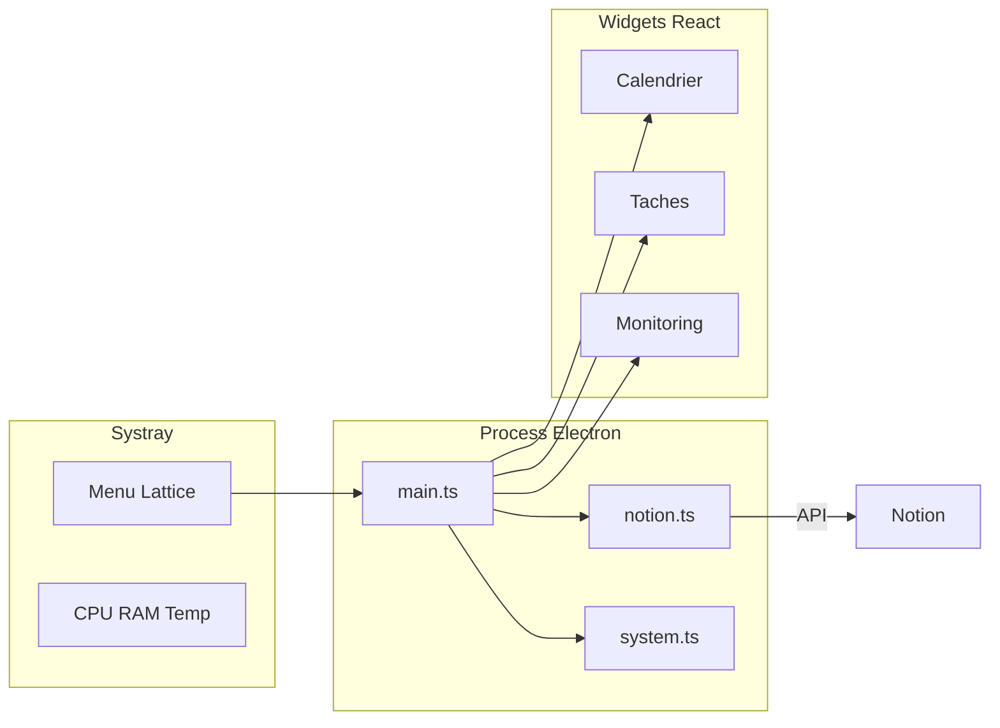

[English](README.md) · [Français](README.fr.md)

# Lattice

<p align="center">
  <a href="https://skillicons.dev">
    
  </a>
</p>

<p align="center">
  
  
  
  
</p>

> Widgets bureau composables pour Windows — garder le Tracker Notion et les stats système sur le bureau, sans quitter le flux de travail.

## Table des matières

- [Pourquoi Lattice](#pourquoi-lattice)
- [Fonctionnalités](#fonctionnalités)
- [Démarrage rapide](#démarrage-rapide)
- [Pour les développeurs](#pour-les-développeurs)
- [Commandes](#commandes)
- [Documentation](#documentation)
- [Auteur](#auteur)
- [Licence](#licence)

## Pourquoi Lattice

- **Notion sur le bureau** — calendrier et tâches ouvertes restent visibles à côté du travail, pas enfouis dans un onglet navigateur.
- **Monitoring systray** — CPU, RAM et température CPU optionnelle en un clic, toujours au premier plan quand on en a besoin.
- **Peu de friction** — un raccourci lance l’app ; elle se recompile seule si le code a changé.
- **Respecte l’inactivité** — les rafraîchissements ralentissent quand on s’absente, pour laisser la machine tranquille.

## Fonctionnalités

### Calendrier

Vue semaine (lun. → dim.) avec les tâches Notion datées en cartes. Clic sur une carte pour ouvrir le panneau détail (description = corps de la page Notion, lien vers Notion).

### Tâches

Liste des tâches ouvertes avec pastilles (État), importance et urgence. Même panneau détail que le calendrier. Les éléments terminés peuvent être masqués via la config.

### Monitoring

Jauge en anneaux pour CPU %, RAM % et température (°C). Ouverture depuis le systray en pop-up always-on-top. La température utilise un helper optionnel élevé (`tools/cpu-temp`, LibreHardwareMonitorLib).

### Menu systray

- Afficher / masquer les widgets calendrier et tâches
- Ouvrir le monitoring
- Rafraîchir les tâches Notion
- Ouvrir le fichier config
- Activer / désactiver le service température
- Lancer au démarrage de Windows

### Mode démo

Sans token Notion valide, Lattice tourne en mode démo avec des données d’exemple pour tester l’UI tout de suite. Régler `demoMode` ou coller de vrais identifiants dans `config.json` — voir [connexion Notion](docs/fr/notion.md).

### Rafraîchissement adaptatif

Les modes d’alimentation (`active` / `idle` / `sleep`) ajustent le polling Notion et stats selon la visibilité des widgets et l’inactivité système.

> Ancien nom : `windows-widgets` → `lattice-desk`. La config AppData existante est migrée automatiquement au premier lancement.

## Démarrage rapide

**Prérequis :** Windows 10/11, [Node.js 20+](https://nodejs.org/), et (pour la température) un [.NET SDK](https://dotnet.microsoft.com/download) une fois au build.

1. Double-cliquer `Preparer-lancement.bat` (une fois, ou après une mise à jour) — installe les deps, build, crée les raccourcis Bureau / menu Démarrer.
2. Lancer le raccourci **Lattice**.
3. Brancher Notion → [docs/fr/notion.md](docs/fr/notion.md) (English: [docs/en/notion.md](docs/en/notion.md)).
4. Optionnel : systray → **Lancer au démarrage de Windows**.

Le raccourci recompile automatiquement si les sources ont changé depuis le dernier build.

La config vit dans `%APPDATA%\lattice-desk\config.json` (systray → **Notion** → **Ouvrir le fichier config**). En développement, un `config.json` à la racine du projet fonctionne aussi.

## Pour les développeurs

```bash
npm install
npm run dev      # Vite + Electron hot reload
npm run build    # Build production (inclut le helper cpu-temp)
npm run app      # Lance le dernier build production
```

| Prérequis | Pourquoi |
| --- | --- |
| Node.js 20+ | Runtime et outillage |
| .NET SDK | Compile `tools/cpu-temp` via `npm run build:temp` |
| Windows | Plateforme cible (Electron + tray + raccourcis) |

Setup complet, arborescence et packaging : [docs/fr/development.md](docs/fr/development.md).



## Commandes

| Commande | Description |
| --- | --- |
| `npm install` | Installer les dépendances |
| `npm run build:temp` | Compiler le helper température CPU |
| `npm run build` | Build production (UI + Electron + helper temp) |
| `npm run app` | Lancer l’app depuis le dernier build |
| `npm run dev` | Mode développement (Vite + Electron) |
| `npm run shortcuts` | Recréer les raccourcis Bureau / menu Démarrer |
| `npm run dist` | Packager un installateur NSIS (`release/`) |

## Documentation

| Sujet | English | Français |
| --- | --- | --- |
| Index docs | [docs/en](docs/en/README.md) | [docs/fr](docs/fr/README.md) |
| Architecture | [architecture.md](docs/en/architecture.md) | [architecture.md](docs/fr/architecture.md) |
| Développement | [development.md](docs/en/development.md) | [development.md](docs/fr/development.md) |
| Configuration | [configuration.md](docs/en/configuration.md) | [configuration.md](docs/fr/configuration.md) |
| Connexion Notion | [notion.md](docs/en/notion.md) | [notion.md](docs/fr/notion.md) |

## Auteur

**[Vakz](https://github.com/vakz0)** — étudiant ingénieur (France).  
Projet perso : synchroniser le Tracker Notion sur le bureau et surveiller CPU, RAM et température sans quitter le flux de travail.

## Licence

Distribué sous licence [MIT](LICENSE).  
Composants tiers : voir [THIRD_PARTY_NOTICES.md](THIRD_PARTY_NOTICES.md) (notamment LibreHardwareMonitorLib, MPL-2.0).
