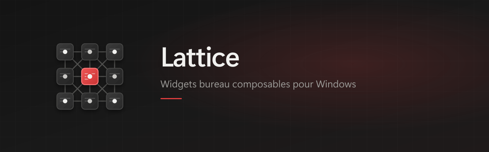

[English](README.md) · [Français](README.fr.md)

# Lattice

<p align="center">
  
</p>

<p align="center">
  <a href="https://skillicons.dev">
    
  </a>
</p>

<p align="center">
  
  
  
  
</p>

> Composable desktop widgets for Windows — enable only what you need (Notion calendar & tasks, activity tracking, …).

## Features

- **Catalog** — empty shell on first launch; enable Calendar, Tasks, Activity from the systray
- **Notion** — week calendar + open tasks on the desktop (demo mode without a token)
- **Activity** — local focus time by app/category (work, entertainment, …) with CSV/JSON export; optional [media extension](extensions/lattice-media/README.md) to suppress AFK while a video plays — [guide](docs/en/activity.md)
- **Updates** — NSIS installer via GitHub Releases; silent check on startup + Settings buttons (app and external widgets)

## Quick start

1. Download the installer from [Releases](https://github.com/Vakz0/Lattice/releases/latest) (`Lattice Setup x.y.z.exe`)
2. Install, then launch **Lattice**
3. Systray → **Catalogue des widgets…** → enable widgets
4. Systray → **Paramètres…** → connect Notion — [setup guide](docs/en/notion.md)
5. Optional: **Lancer au démarrage**

### Updates

- On startup, Lattice silently checks for updates (app + external widgets).
- Systray → **Paramètres…** → **Mises à jour**:
  - **Check app update** / **Install and restart**
  - **Check widget updates** / **Update widgets**
  - **Automatic download** option: downloads in the background and shows a Windows notification when ready (install still requires confirmation)

Config: `%APPDATA%\lattice-desk\config.json`. See `config.example.json`.

### From source (development)

**Requirements:** Windows 10/11, [Node.js 20+](https://nodejs.org/), and (for temperature) a [.NET SDK](https://dotnet.microsoft.com/download) once at build time.

1. Double-click `Preparer-lancement.bat` (once, or after a `git pull`)
2. Launch the **Lattice** shortcut

Automatic updates only apply to the NSIS-installed app.

## Development

```bash
npm install
npm run dev      # Vite + Electron
npm run build    # Production build
npm run app      # Run last build
npm run dist     # NSIS installer → release/
```

Publish a release: tag `vX.Y.Z` → GitHub Actions workflow (see [docs/en/development.md](docs/en/development.md)).

## Docs

| | English | Français |
| --- | --- | --- |
| Notion | [notion.md](docs/en/notion.md) | [notion.md](docs/fr/notion.md) |
| Activity | [activity.md](docs/en/activity.md) | [activity.md](docs/fr/activity.md) |
| Development | [development.md](docs/en/development.md) | [development.md](docs/fr/development.md) |
| Decisions | [decisions.md](docs/en/decisions.md) | [decisions.md](docs/fr/decisions.md) |

Agent constitution: [`CLAUDE.md`](CLAUDE.md) · rules & memory: [`.claude/`](.claude/).

## Author

**[Vakz](https://github.com/vakz0)** — engineering student (France).

## License

[MIT](LICENSE) — third-party notices: [THIRD_PARTY_NOTICES.md](THIRD_PARTY_NOTICES.md).
