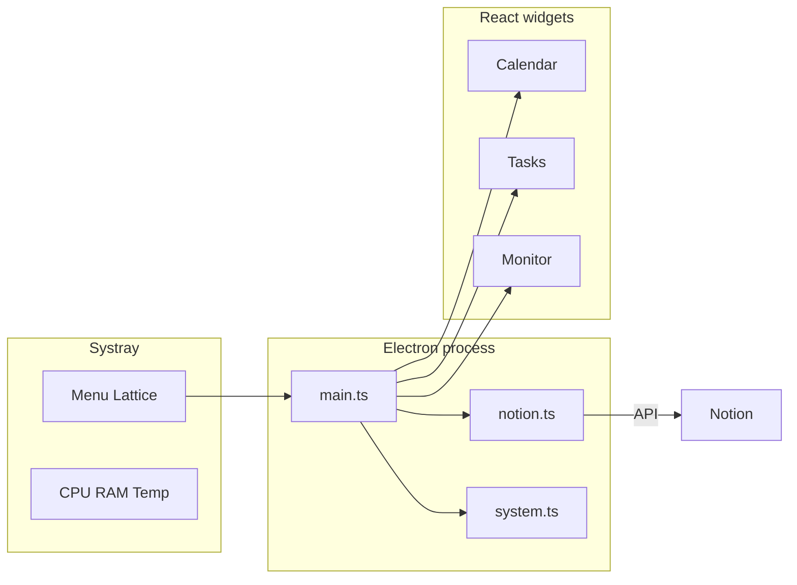

[English](README.md) · [Français](README.fr.md)

# Lattice

<p align="center">
  
</p>

<p align="center">
  <a href="https://skillicons.dev">
    
  </a>
</p>

<p align="center">
  
  
  
  
</p>

> Widgets bureau composables pour Windows — plateforme shell : activez uniquement les widgets dont vous avez besoin (Notion, monitoring, …).

## Table des matières

- [Why Lattice](#why-lattice)
- [Features](#features)
- [Quick start](#quick-start)
- [For developers](#for-developers)
- [Commands](#commands)
- [Documentation](#documentation)
- [Author](#author)
- [License](#license)

## Why Lattice

- **Platform first** — a fresh install is an empty shell; add calendar, tasks, monitoring (and future widgets) from the catalog.
- **Notion on your desktop** — calendar and open tasks stay visible next to your work, not buried in a browser tab.
- **Systray monitoring** — CPU, RAM, and optional CPU temperature in one click, always on top when you need it.
- **Low friction** — one shortcut launches the app; it rebuilds itself when the code changes.
- **Respects idle time** — refresh rates slow down when you are away, so the machine stays quiet.

## Features

### Widget catalog

Lattice ships as a **platform**: no desktop widgets until you enable them. Open **Catalogue des widgets…** from the systray (or left-click the tray when monitoring is off) to activate or deactivate built-in widgets. Config key: `widgets` in `config.json` (empty `{}` on a new install). Legacy configs without `widgets` keep calendar + tasks enabled.

### Settings

In-catalog **Paramètres** tab (or systray → **Paramètres…**) to connect Notion (token + database + property mapping), edit `refreshIntervalSeconds`, `launchAtStartup`, and `demoMode`, open `config.json`, and show the app version.

### Calendar

Week view (Mon → Sun) with dated Notion tasks as cards (primary database + optional secondary sources). Click a card to open the detail panel (description from the Notion page body or a mapped property, link back to Notion). Requires the calendar widget to be enabled.

### Tasks

List of open tasks with tags, importance, and urgency. Secondary-source tasks show a source label. Same detail panel as the calendar. Completed items can be hidden via config. Requires the tasks widget to be enabled.

### Secondary Notion sources

Optionally merge tasks from another Notion database filtered by a project relation (`projectSources` in `config.json`). Those tasks show a small source label in the calendar and tasks widgets. See [Notion setup](docs/en/notion.md#4-optional-secondary-sources-projectsources).

### Monitoring

Ring gauges for CPU %, RAM %, and temperature (°C). Opens from the systray as an always-on-top pop-up. Temperature uses an optional elevated helper (`tools/cpu-temp`, LibreHardwareMonitorLib). Requires the monitoring widget to be enabled.

### Systray menu

- Open the widget catalog
- Open settings (catalog → Paramètres)
- Show / hide enabled desktop widgets (flat checkboxes)
- Open monitoring (when enabled)
- Refresh Notion / toggle temperature / open config (when relevant)
- Launch at Windows startup

### Demo mode

Without a valid Notion token, Lattice runs in demo mode with sample data so you can try the UI immediately (once Notion widgets are enabled). Connect credentials in **Paramètres** or paste them in `config.json` — see [Notion setup](docs/en/notion.md).

### Adaptive refresh

Power modes (`active` / `idle` / `sleep`) adjust Notion and stats polling based on widget visibility and system idle time. Background Notion polling runs only while at least one Notion-backed widget is enabled.

> Renamed from `windows-widgets` to `lattice-desk`. Existing AppData config is migrated automatically on first launch.

## Quick start

**Requirements:** Windows 10/11, [Node.js 20+](https://nodejs.org/), and (for temperature) a [.NET SDK](https://dotnet.microsoft.com/download) once at build time.

1. Double-click `Preparer-lancement.bat` (once, or after an update) — installs deps, builds, creates Desktop / Start Menu shortcuts.
2. Launch the **Lattice** shortcut (tray icon only on a fresh install).
3. Systray → **Catalogue des widgets…** → enable Calendar, Tasks, and/or Monitoring.
4. Systray → **Paramètres…** → connect Notion (token + database URL). Details: [docs/en/notion.md](docs/en/notion.md) (French: [docs/fr/notion.md](docs/fr/notion.md)).
5. Optional: systray → **Launch at Windows startup**.

The shortcut recompiles automatically if source files changed since the last build.

Config lives at `%APPDATA%\lattice-desk\config.json` (tray → **Paramètres** → **Ouvrir config.json**, or under **Notion** when a Notion widget is enabled). You can also keep a `config.json` in the project root during development.

## For developers

```bash
npm install
npm run dev      # Vite + Electron hot reload
npm run build    # Production build (includes cpu-temp helper)
npm run app      # Run the last production build
```

| Prerequisite | Why |
| --- | --- |
| Node.js 20+ | App runtime and tooling |
| .NET SDK | Builds `tools/cpu-temp` via `npm run build:temp` |
| Windows | Target platform (Electron + tray + shortcuts) |

Full setup, folder layout, and packaging: [docs/en/development.md](docs/en/development.md).



## Commands

| Command | Description |
| --- | --- |
| `npm install` | Install dependencies |
| `npm run build:temp` | Build the CPU temperature helper |
| `npm run build` | Production build (UI + Electron + temp helper) |
| `npm run app` | Launch the app from the last build |
| `npm run dev` | Development mode (Vite + Electron) |
| `npm run shortcuts` | Recreate Desktop / Start Menu shortcuts |
| `npm run dist` | Package an NSIS installer (`release/`) |

## Documentation

| Topic | English | Français |
| --- | --- | --- |
| Docs index | [docs/en](docs/en/README.md) | [docs/fr](docs/fr/README.md) |
| Architecture | [architecture.md](docs/en/architecture.md) | [architecture.md](docs/fr/architecture.md) |
| Development | [development.md](docs/en/development.md) | [development.md](docs/fr/development.md) |
| Configuration | [configuration.md](docs/en/configuration.md) | [configuration.md](docs/fr/configuration.md) |
| Notion setup | [notion.md](docs/en/notion.md) | [notion.md](docs/fr/notion.md) |
| Brand identity | [brand.md](docs/en/brand.md) | [brand.md](docs/fr/brand.md) |

## Author

**[Vakz](https://github.com/vakz0)** — engineering student (France).  
Personal project: composable Windows desktop widgets with optional Notion sync and system monitoring.

## License

Distributed under the [MIT](LICENSE) license.  
Third-party components: see [THIRD_PARTY_NOTICES.md](THIRD_PARTY_NOTICES.md) (including LibreHardwareMonitorLib, MPL-2.0).
