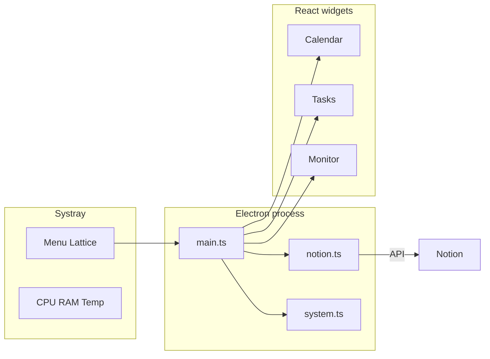

[English](README.md) · [Français](README.fr.md)

# Lattice

<p align="center">
  <a href="https://skillicons.dev">
    
  </a>
</p>

<p align="center">
  
  
  
  
</p>

> Composable desktop widgets for Windows — keep your Notion tracker and system stats on the desktop, without leaving your workflow.

## Table of contents

- [Why Lattice](#why-lattice)
- [Features](#features)
- [Quick start](#quick-start)
- [For developers](#for-developers)
- [Commands](#commands)
- [Documentation](#documentation)
- [Author](#author)
- [License](#license)

## Why Lattice

- **Notion on your desktop** — calendar and open tasks stay visible next to your work, not buried in a browser tab.
- **Systray monitoring** — CPU, RAM, and optional CPU temperature in one click, always on top when you need it.
- **Low friction** — one shortcut launches the app; it rebuilds itself when the code changes.
- **Respects idle time** — refresh rates slow down when you are away, so the machine stays quiet.

## Features

### Calendar

Week view (Mon → Sun) with dated Notion tasks as cards. Click a card to open the detail panel (description from the Notion page body, link back to Notion).

### Tasks

List of open tasks with tags (État), importance, and urgency. Same detail panel as the calendar. Completed items can be hidden via config.

### Monitoring

Ring gauges for CPU %, RAM %, and temperature (°C). Opens from the systray as an always-on-top pop-up. Temperature uses an optional elevated helper (`tools/cpu-temp`, LibreHardwareMonitorLib).

### Systray menu

- Show / hide calendar and tasks widgets
- Open monitoring
- Refresh Notion tasks
- Open the config file
- Enable / disable the temperature service
- Launch at Windows startup

### Demo mode

Without a valid Notion token, Lattice runs in demo mode with sample data so you can try the UI immediately. Set `demoMode` or paste real credentials in `config.json` — see [Notion setup](docs/en/notion.md).

### Adaptive refresh

Power modes (`active` / `idle` / `sleep`) adjust Notion and stats polling based on widget visibility and system idle time.

> Renamed from `windows-widgets` to `lattice-desk`. Existing AppData config is migrated automatically on first launch.

## Quick start

**Requirements:** Windows 10/11, [Node.js 20+](https://nodejs.org/), and (for temperature) a [.NET SDK](https://dotnet.microsoft.com/download) once at build time.

1. Double-click `Preparer-lancement.bat` (once, or after an update) — installs deps, builds, creates Desktop / Start Menu shortcuts.
2. Launch the **Lattice** shortcut.
3. Connect Notion → [docs/en/notion.md](docs/en/notion.md) (French: [docs/fr/notion.md](docs/fr/notion.md)).
4. Optional: systray → **Launch at Windows startup**.

The shortcut recompiles automatically if source files changed since the last build.

Config lives at `%APPDATA%\lattice-desk\config.json` (tray → **Notion** → **Open config file**). You can also keep a `config.json` in the project root during development.

## For developers

```bash
npm install
npm run dev      # Vite + Electron hot reload
npm run build    # Production build (includes cpu-temp helper)
npm run app      # Run the last production build
```

| Prerequisite | Why |
| --- | --- |
| Node.js 20+ | App runtime and tooling |
| .NET SDK | Builds `tools/cpu-temp` via `npm run build:temp` |
| Windows | Target platform (Electron + tray + shortcuts) |

Full setup, folder layout, and packaging: [docs/en/development.md](docs/en/development.md).



## Commands

| Command | Description |
| --- | --- |
| `npm install` | Install dependencies |
| `npm run build:temp` | Build the CPU temperature helper |
| `npm run build` | Production build (UI + Electron + temp helper) |
| `npm run app` | Launch the app from the last build |
| `npm run dev` | Development mode (Vite + Electron) |
| `npm run shortcuts` | Recreate Desktop / Start Menu shortcuts |
| `npm run dist` | Package an NSIS installer (`release/`) |

## Documentation

| Topic | English | Français |
| --- | --- | --- |
| Docs index | [docs/en](docs/en/README.md) | [docs/fr](docs/fr/README.md) |
| Architecture | [architecture.md](docs/en/architecture.md) | [architecture.md](docs/fr/architecture.md) |
| Development | [development.md](docs/en/development.md) | [development.md](docs/fr/development.md) |
| Configuration | [configuration.md](docs/en/configuration.md) | [configuration.md](docs/fr/configuration.md) |
| Notion setup | [notion.md](docs/en/notion.md) | [notion.md](docs/fr/notion.md) |

## Author

**[Vakz](https://github.com/vakz0)** — engineering student (France).  
Personal project: sync a Notion Tracker to the desktop and watch CPU, RAM, and temperature without breaking flow.

## License

Distributed under the [MIT](LICENSE) license.  
Third-party components: see [THIRD_PARTY_NOTICES.md](THIRD_PARTY_NOTICES.md) (including LibreHardwareMonitorLib, MPL-2.0).
