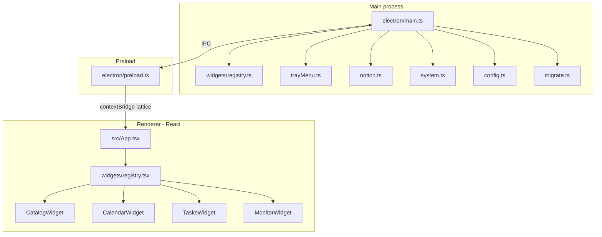
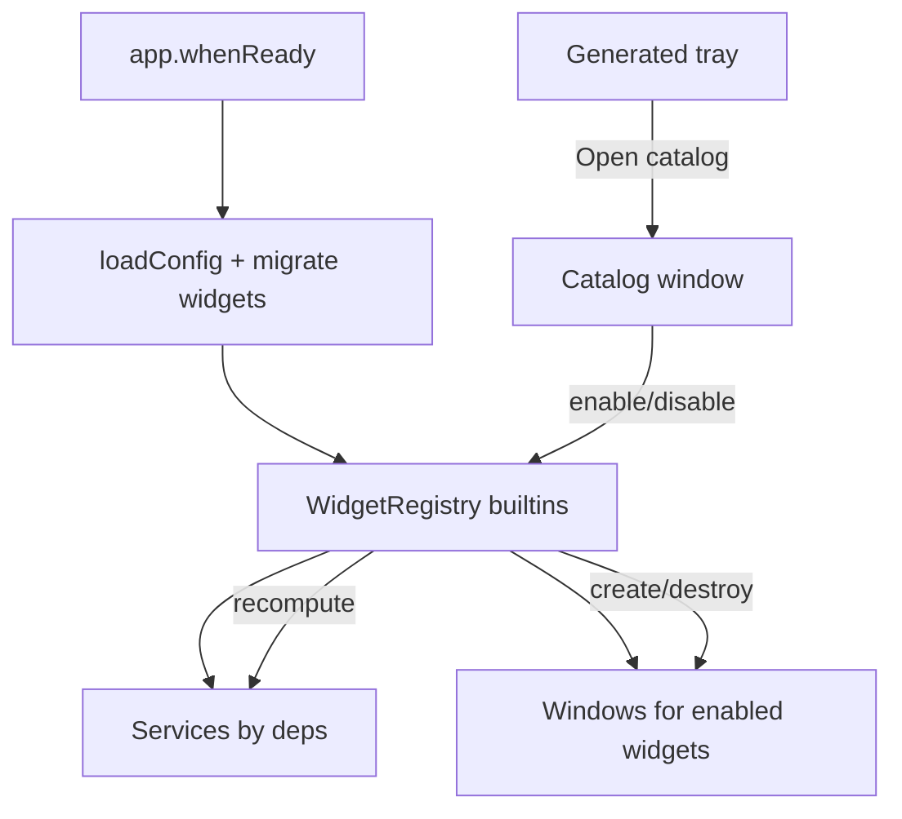
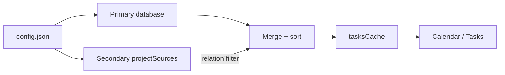

# Architecture

[English](../en/architecture.md) · [Français](../fr/architecture.md)

> How Lattice is structured: platform shell, widget registry, Electron main process, IPC, and background services.

## Processes

| Layer | Role |
| --- | --- |
| **Main** (`electron/`) | Windows, tray, timers, Notion API, system stats, config I/O, widget lifecycle |
| **Registry** (`electron/widgets/`) | Builtin definitions + external discovery stub |
| **Preload** (`electron/preload.ts`) | Safe `window.lattice` API via `contextBridge` |
| **Renderer** (`src/`) | Catalog and widget UIs (React) |

Shared types: [`shared/types.ts`](../../shared/types.ts), widget contract: [`shared/widget.ts`](../../shared/widget.ts).

## Platform and catalog

Lattice is a **shell**: a fresh install opens no widget windows. Users enable / disable widgets from the **Catalog** window (tray → **Catalogue des widgets…**).

| Concept | Role |
| --- | --- |
| **enabled** | Widget installed on the platform (window created, services started) — catalog / `config.widgets` |
| **visible** | Show / hide of an already-enabled desktop widget — tray « Widgets bureau » |

### Registry

- Builtin: [`electron/widgets/registry.ts`](../../electron/widgets/registry.ts) (`calendar`, `tasks`, `monitor`)
- External (stub): [`electron/widgets/discoverExternal.ts`](../../electron/widgets/discoverExternal.ts) scans `%APPDATA%/lattice-desk/widgets/*/manifest.json` but does not load plugins yet
- Renderer: [`src/widgets/registry.tsx`](../../src/widgets/registry.tsx) maps id → component; [`src/App.tsx`](../../src/App.tsx) resolves `?widget=`

Each definition declares `placement` (`desktop` | `popup`), `services` (`notion`, `system-stats`, `temp-daemon`), and window options.

### Shipped widgets

| Id | Component | Placement | On boot if enabled |
| --- | --- | --- | --- |
| `calendar` | `CalendarWidget` | desktop | Window created and shown |
| `tasks` | `TasksWidget` | desktop | Window created and shown |
| `monitor` | `MonitorWidget` | pop-up | Lazy until tray click |
| `catalog` | `CatalogWidget` | system UI | Outside the user catalog |

Disabling a widget **destroys** its window. Notion / temperature services run only while an enabled widget declares them.

## IPC surface

Exposed as `window.lattice` ([`electron/preload.ts`](../../electron/preload.ts)):

| Method / event | Direction | Purpose |
| --- | --- | --- |
| `listWidgets` | invoke | Catalog list (definitions + enabled) |
| `setWidgetEnabled` | invoke | Enable / disable a widget |
| `openCatalog` / `closeCatalog` | invoke | Open / close the catalog window |
| `onWidgetsChanged` | event | Push after enable/disable |
| `getTasks` / `refreshTasks` | invoke | Merged Notion task list |
| `getTaskDescription` | invoke | Task description |
| `getStats` | invoke | Latest CPU / RAM / temp |
| `getConfig` | invoke | Public config subset for the UI |
| `updatePublicSettings` | invoke | Write `refreshIntervalSeconds` / `demoMode` / `launchAtStartup` to `config.json` |
| `getNotionSettings` | invoke | Same public config (Notion fields included) |
| `saveNotionSettings` | invoke | Write token (optional), database, properties, filters |
| `testNotionConnection` | invoke | `databases.retrieve` — validate creds + suggest property mapping |
| `getAppVersion` | invoke | `package.json` version |
| `openConfigFile` | invoke | Open userData `config.json` |
| `openExternal` | invoke | Open URLs in the browser |
| `hideMonitor` | invoke | Close the monitor pop-up |
| `enableTemp` / `disableTemp` | invoke | Temperature daemon |
| `onTasksUpdated` / `onTasksError` | event | Push task updates |
| `onStatsUpdated` | event | Push system stats |
| `onCatalogNavigate` | event | Switch catalog ↔ settings |

## Power modes

[`electron/main.ts`](../../electron/main.ts) computes `active` | `idle` | `sleep` from:

- system sleep / resume
- system idle time (≥ 180 s → sleep)
- pop-up widget visibility (forces active)
- enabled desktop widget visibility (idle)

| Mode | Notion poll | Stats poll |
| --- | --- | --- |
| `active` | base interval (`refreshIntervalSeconds`, min 60 s) | every 2 s |
| `idle` | base × 3 | every 30 s |
| `sleep` | base × 10 | stopped |

Notion polling is **stopped** when no enabled widget declares the `notion` service. The tray still samples lightly for the tooltip.

## Notion flow (multi-source)

[`electron/notion.ts`](../../electron/notion.ts) queries the primary database (`databaseId`), then each `projectSources` entry with a relation filter to the project page. Results are deduplicated by ID, sorted by date, and cached in the main process.

If a project source fails, the primary database is still served. Notion URLs (`databaseId`, `projectPageId`) are converted to UUIDs before API calls.

## Temperature daemon

[`electron/system.ts`](../../electron/system.ts) resolves `cpu-temp.exe` (packaged under `resources/cpu-temp` or `tools/cpu-temp/publish`). The helper (C#, LibreHardwareMonitorLib) runs elevated when enabled from the tray (menu shown only if monitoring is enabled). Readings are cached under userData (`temp-cache.json`).

CPU % uses a local `os.cpus()` delta; RAM uses `systeminformation`.

## Config and migration

- Load order: cwd `config.json` → app path → `%APPDATA%\lattice-desk\config.json`
- Merge from userData: `windows`, `widgets`, and `projectSources` (when missing from the higher-priority file)
- If the `widgets` key is absent (legacy config) → `calendar` + `tasks` enabled, `monitor` disabled
- Fresh install / `config.example.json` → `"widgets": {}`
- Valid credentials are persisted to userData
- [`electron/migrate.ts`](../../electron/migrate.ts) copies legacy folders (`windows-widgets`, `Windows Widgets`) into `lattice-desk` on first run

See [Configuration](configuration.md) for the full schema.
