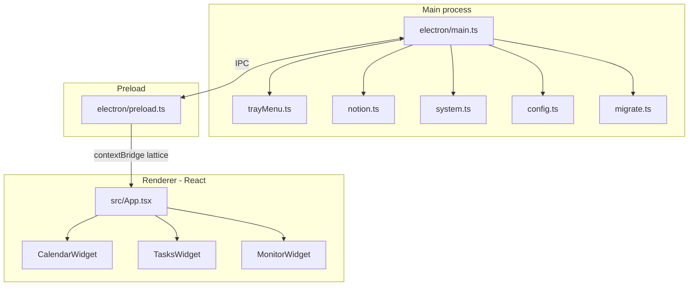

# Architecture

[English](../en/architecture.md) · [Français](../fr/architecture.md)

> How Lattice is structured: Electron main process, React widgets, IPC, and background services.

## Processes

| Layer | Role |
| --- | --- |
| **Main** (`electron/`) | Windows, tray, timers, Notion API, system stats, config I/O |
| **Preload** (`electron/preload.ts`) | Exposes a safe `window.lattice` API via `contextBridge` |
| **Renderer** (`src/`) | Frameless widget UIs (React) |

Shared TypeScript types live in [`shared/types.ts`](../../shared/types.ts).

## Widgets

[`src/App.tsx`](../../src/App.tsx) picks the widget from the query string `?widget=`:

| Value | Component | Default behavior |
| --- | --- | --- |
| `calendar` | `CalendarWidget` | Shown on launch (desktop) |
| `tasks` | `TasksWidget` | Shown on launch (desktop) |
| `monitor` | `MonitorWidget` | Hidden until opened from the tray |

Each kind is its own `BrowserWindow` (frameless, skip taskbar). Calendar and tasks remember size/position in config. Monitor is always-on-top and sized for the gauge layout.

## IPC surface

Exposed as `window.lattice` ([`electron/preload.ts`](../../electron/preload.ts)):

| Method / event | Direction | Purpose |
| --- | --- | --- |
| `getTasks` / `refreshTasks` | invoke | Cached / forced Notion task list |
| `getTaskDescription` | invoke | Page body for the detail panel |
| `getStats` | invoke | Latest CPU / RAM / temp |
| `getConfig` | invoke | Public config subset for the UI |
| `openExternal` | invoke | Open Notion URLs in the browser |
| `hideMonitor` | invoke | Close the monitor pop-up |
| `enableTemp` / `disableTemp` | invoke | Start / stop the temp daemon |
| `onTasksUpdated` / `onTasksError` | event | Push task updates / errors |
| `onStatsUpdated` | event | Push system stats |

## Power modes

[`electron/main.ts`](../../electron/main.ts) computes `active` | `idle` | `sleep` from:

- system sleep / resume
- system idle time (≥ 180 s → sleep)
- monitor visibility (forces active)
- desktop widget visibility (idle if only calendar/tasks are open)

| Mode | Notion poll | Stats poll |
| --- | --- | --- |
| `active` | base interval (`refreshIntervalSeconds`, min 60 s) | every 2 s |
| `idle` | base × 3 | every 30 s |
| `sleep` | base × 10 | stopped |

## Temperature daemon

[`electron/system.ts`](../../electron/system.ts) resolves `cpu-temp.exe` (packaged under `resources/cpu-temp` or `tools/cpu-temp/publish`). The helper (C#, LibreHardwareMonitorLib) runs elevated when enabled from the tray. Readings are cached under userData (`temp-cache.json`).

CPU % uses a local `os.cpus()` delta; RAM uses `systeminformation`.

## Config and migration

- Load order: cwd `config.json` → app path → `%APPDATA%\lattice-desk\config.json`
- Valid credentials are persisted to userData
- [`electron/migrate.ts`](../../electron/migrate.ts) copies legacy folders (`windows-widgets`, `Windows Widgets`) into `lattice-desk` on first run

See [Configuration](configuration.md) for the full schema.
