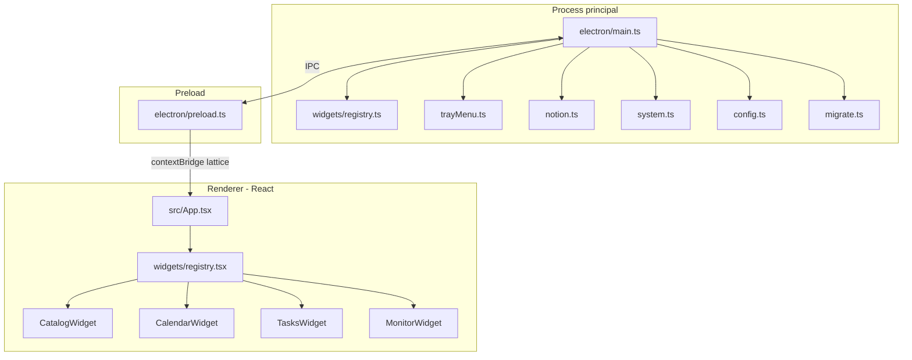
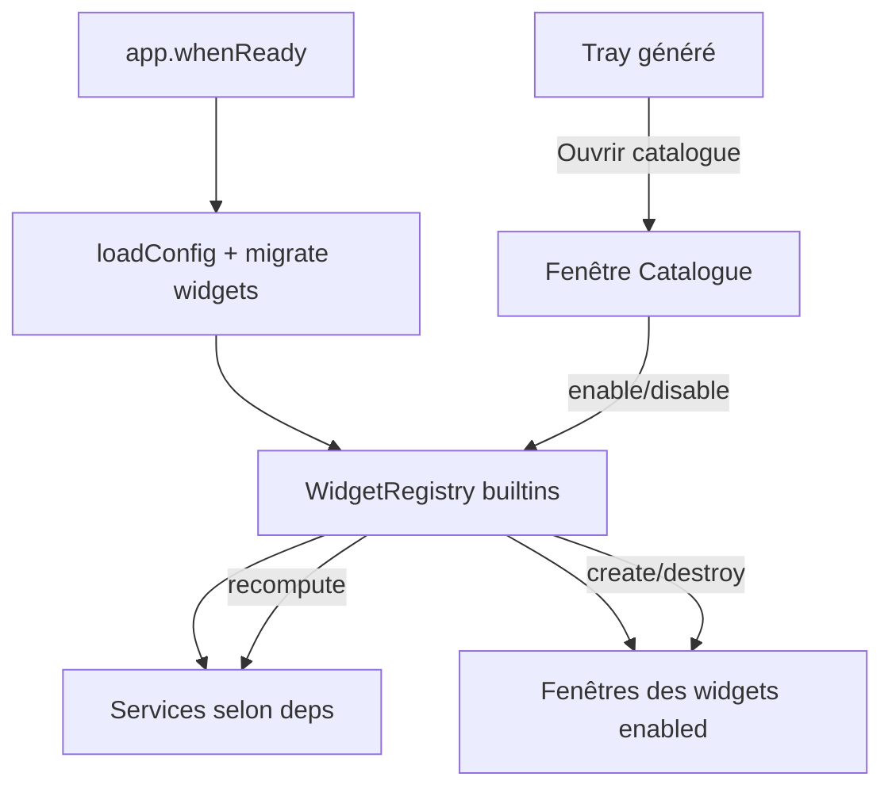
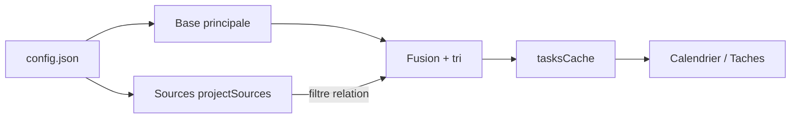

# Architecture

[English](../en/architecture.md) · [Français](../fr/architecture.md)

> Structure de Lattice : shell plateforme, registre de widgets, process Electron, IPC et services d’arrière-plan.

## Processus

| Couche | Rôle |
| --- | --- |
| **Main** (`electron/`) | Fenêtres, tray, timers, API Notion, stats, I/O config, cycle de vie widgets |
| **Registre** (`electron/widgets/`) | Définitions builtin + stub découverte externe |
| **Preload** (`electron/preload.ts`) | API sûre `window.lattice` via `contextBridge` |
| **Renderer** (`src/`) | UI catalogue et widgets (React) |

Types partagés : [`shared/types.ts`](../../shared/types.ts), contrat widget : [`shared/widget.ts`](../../shared/widget.ts).

## Plateforme et catalogue

Lattice est un **shell** : une install neuve n’ouvre aucune fenêtre widget. L’utilisateur active / désactive les widgets via la fenêtre **Catalogue** (tray → **Catalogue des widgets…**).

| Concept | Rôle |
| --- | --- |
| **enabled** | Widget installé sur la plateforme (fenêtre créée, services démarrés) — géré dans le catalogue / `config.widgets` |
| **visible** | Show / hide d’un widget bureau déjà activé — menu tray « Widgets bureau » |

### Registre

- Builtin : [`electron/widgets/registry.ts`](../../electron/widgets/registry.ts) (`calendar`, `tasks`, `monitor`)
- Externe (stub) : [`electron/widgets/discoverExternal.ts`](../../electron/widgets/discoverExternal.ts) scanne `%APPDATA%/lattice-desk/widgets/*/manifest.json` mais ne charge encore aucun plugin
- Renderer : [`src/widgets/registry.tsx`](../../src/widgets/registry.tsx) mappe id → composant ; [`src/App.tsx`](../../src/App.tsx) résout `?widget=`

Chaque définition déclare `placement` (`desktop` | `popup`), `services` (`notion`, `system-stats`, `temp-daemon`) et les options de fenêtre.

### Widgets livrés

| Id | Composant | Placement | Au démarrage si enabled |
| --- | --- | --- | --- |
| `calendar` | `CalendarWidget` | bureau | Fenêtre créée et affichée |
| `tasks` | `TasksWidget` | bureau | Fenêtre créée et affichée |
| `monitor` | `MonitorWidget` | pop-up | Lazy jusqu’au clic tray |
| `catalog` | `CatalogWidget` | UI système | Hors catalogue utilisateur |

Désactiver un widget **détruit** sa fenêtre. Les services Notion / température ne tournent que si un widget activé les déclare.

## Surface IPC

Exposée comme `window.lattice` ([`electron/preload.ts`](../../electron/preload.ts)) :

| Méthode / événement | Sens | Rôle |
| --- | --- | --- |
| `listWidgets` | invoke | Liste catalogue (définitions + enabled) |
| `setWidgetEnabled` | invoke | Activer / désactiver un widget |
| `openCatalog` / `closeCatalog` | invoke | Ouvrir / fermer la fenêtre catalogue |
| `onWidgetsChanged` | event | Push après enable/disable |
| `getTasks` / `refreshTasks` | invoke | Liste tâches Notion fusionnées |
| `getTaskDescription` | invoke | Description tâche |
| `getStats` | invoke | Dernières mesures CPU / RAM / temp |
| `getConfig` | invoke | Sous-ensemble public de la config |
| `updatePublicSettings` | invoke | Écrire `refreshIntervalSeconds` / `demoMode` / `launchAtStartup` dans `config.json` |
| `getNotionSettings` | invoke | Même config publique (champs Notion inclus) |
| `saveNotionSettings` | invoke | Écrire token (optionnel), base, propriétés, filtres |
| `testNotionConnection` | invoke | `databases.retrieve` — valider les creds + proposer le mapping |
| `getAppVersion` | invoke | Version `package.json` |
| `openConfigFile` | invoke | Ouvrir `config.json` (userData) |
| `openExternal` | invoke | Ouvrir les URL dans le navigateur |
| `hideMonitor` | invoke | Fermer le pop-up monitoring |
| `enableTemp` / `disableTemp` | invoke | Daemon température |
| `onTasksUpdated` / `onTasksError` | event | Push tâches |
| `onStatsUpdated` | event | Push stats système |
| `onCatalogNavigate` | event | Basculer catalogue ↔ paramètres |

## Modes d’alimentation

[`electron/main.ts`](../../electron/main.ts) calcule `active` | `idle` | `sleep` à partir de :

- veille / reprise système
- temps d’inactivité système (≥ 180 s → sleep)
- visibilité d’un widget pop-up (force active)
- visibilité des widgets bureau activés (idle)

| Mode | Poll Notion | Poll stats |
| --- | --- | --- |
| `active` | intervalle de base (`refreshIntervalSeconds`, min 60 s) | toutes les 2 s |
| `idle` | base × 3 | toutes les 30 s |
| `sleep` | base × 10 | arrêté |

Le poll Notion est **arrêté** si aucun widget avec le service `notion` n’est activé. Le tray continue un échantillonnage léger pour le tooltip.

## Flux Notion (multi-sources)

[`electron/notion.ts`](../../electron/notion.ts) interroge la base principale (`databaseId`), puis chaque entrée de `projectSources` avec un filtre relation vers la page projet. Les résultats sont dédupliqués par ID, triés par date, et mis en cache dans le process principal.

En cas d’erreur sur une source projet, la base principale reste servie. Les URLs Notion (`databaseId`, `projectPageId`) sont converties en UUID avant l’appel API.

## Daemon température

[`electron/system.ts`](../../electron/system.ts) résout `cpu-temp.exe` (packagé sous `resources/cpu-temp` ou `tools/cpu-temp/publish`). Le helper (C#, LibreHardwareMonitorLib) tourne en élévation quand il est activé depuis le tray (menu visible seulement si le monitoring est activé). Les lectures sont mises en cache dans userData (`temp-cache.json`).

Le % CPU utilise un delta local `os.cpus()` ; la RAM passe par `systeminformation`.

## Config et migration

- Ordre de chargement : `config.json` du cwd → chemin de l’app → `%APPDATA%\lattice-desk\config.json`
- Fusion depuis userData : `windows`, `widgets`, et `projectSources` (si absents du fichier prioritaire)
- Si la clé `widgets` est absente (config legacy) → `calendar` + `tasks` activés, `monitor` désactivé
- Install neuve / `config.example.json` → `"widgets": {}`
- Des identifiants valides sont persistés dans userData
- [`electron/migrate.ts`](../../electron/migrate.ts) copie les dossiers legacy (`windows-widgets`, `Windows Widgets`) vers `lattice-desk` au premier lancement

Voir [Configuration](configuration.md) pour le schéma complet.
