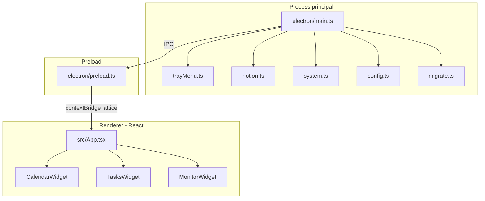

# Architecture

[English](../en/architecture.md) · [Français](../fr/architecture.md)

> Structure de Lattice : process principal Electron, widgets React, IPC et services d’arrière-plan.

## Processus

| Couche | Rôle |
| --- | --- |
| **Main** (`electron/`) | Fenêtres, tray, timers, API Notion, stats système, I/O config |
| **Preload** (`electron/preload.ts`) | Expose une API sûre `window.lattice` via `contextBridge` |
| **Renderer** (`src/`) | UI des widgets sans cadre (React) |

Les types TypeScript partagés sont dans [`shared/types.ts`](../../shared/types.ts).

## Widgets

[`src/App.tsx`](../../src/App.tsx) choisit le widget via la query `?widget=` :

| Valeur | Composant | Comportement par défaut |
| --- | --- | --- |
| `calendar` | `CalendarWidget` | Affiché au lancement (bureau) |
| `tasks` | `TasksWidget` | Affiché au lancement (bureau) |
| `monitor` | `MonitorWidget` | Masqué jusqu’à ouverture depuis le tray |

Chaque type a sa propre `BrowserWindow` (sans cadre, hors barre des tâches). Calendrier et tâches mémorisent taille/position dans la config. Le monitoring est always-on-top et dimensionné pour les jauges.

## Surface IPC

Exposée comme `window.lattice` ([`electron/preload.ts`](../../electron/preload.ts)) :

| Méthode / événement | Sens | Rôle |
| --- | --- | --- |
| `getTasks` / `refreshTasks` | invoke | Liste tâches Notion (cache / forcé) |
| `getTaskDescription` | invoke | Corps de page pour le panneau détail |
| `getStats` | invoke | Dernières mesures CPU / RAM / temp |
| `getConfig` | invoke | Sous-ensemble public de la config pour l’UI |
| `openExternal` | invoke | Ouvrir les URL Notion dans le navigateur |
| `hideMonitor` | invoke | Fermer le pop-up monitoring |
| `enableTemp` / `disableTemp` | invoke | Démarrer / arrêter le daemon température |
| `onTasksUpdated` / `onTasksError` | event | Push mises à jour / erreurs tâches |
| `onStatsUpdated` | event | Push stats système |

## Modes d’alimentation

[`electron/main.ts`](../../electron/main.ts) calcule `active` | `idle` | `sleep` à partir de :

- veille / reprise système
- temps d’inactivité système (≥ 180 s → sleep)
- visibilité du monitoring (force active)
- visibilité des widgets bureau (idle si seuls calendrier/tâches sont ouverts)

| Mode | Poll Notion | Poll stats |
| --- | --- | --- |
| `active` | intervalle de base (`refreshIntervalSeconds`, min 60 s) | toutes les 2 s |
| `idle` | base × 3 | toutes les 30 s |
| `sleep` | base × 10 | arrêté |

## Daemon température

[`electron/system.ts`](../../electron/system.ts) résout `cpu-temp.exe` (packagé sous `resources/cpu-temp` ou `tools/cpu-temp/publish`). Le helper (C#, LibreHardwareMonitorLib) tourne en élévation quand il est activé depuis le tray. Les lectures sont mises en cache dans userData (`temp-cache.json`).

Le % CPU utilise un delta local `os.cpus()` ; la RAM passe par `systeminformation`.

## Config et migration

- Ordre de chargement : `config.json` du cwd → chemin de l’app → `%APPDATA%\lattice-desk\config.json`
- Des identifiants valides sont persistés dans userData
- [`electron/migrate.ts`](../../electron/migrate.ts) copie les dossiers legacy (`windows-widgets`, `Windows Widgets`) vers `lattice-desk` au premier lancement

Voir [Configuration](configuration.md) pour le schéma complet.
